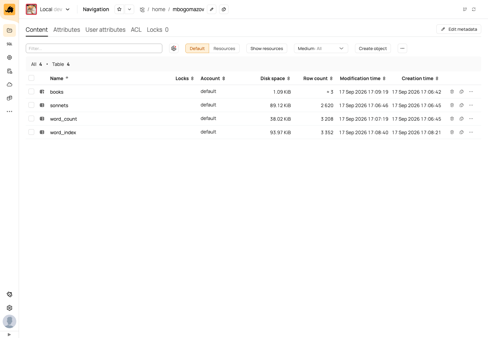
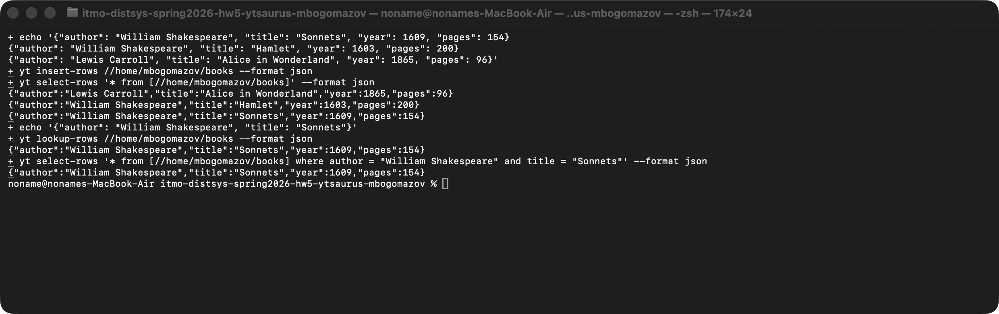
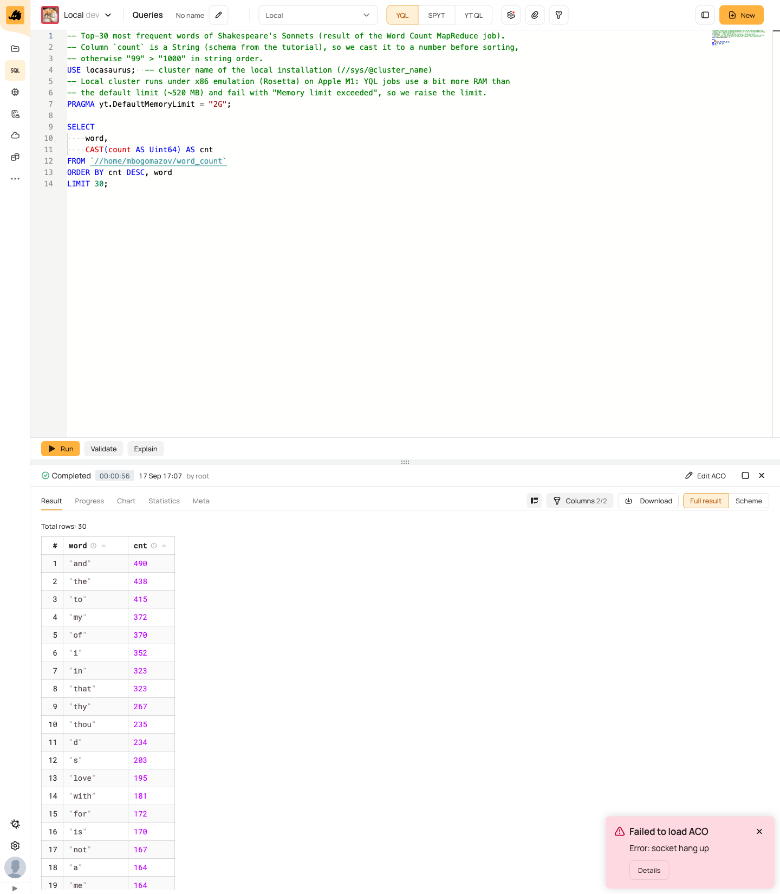
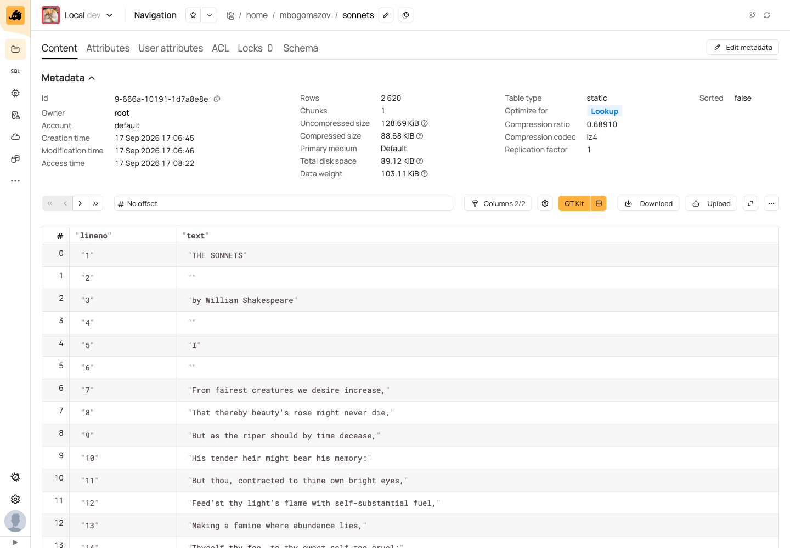
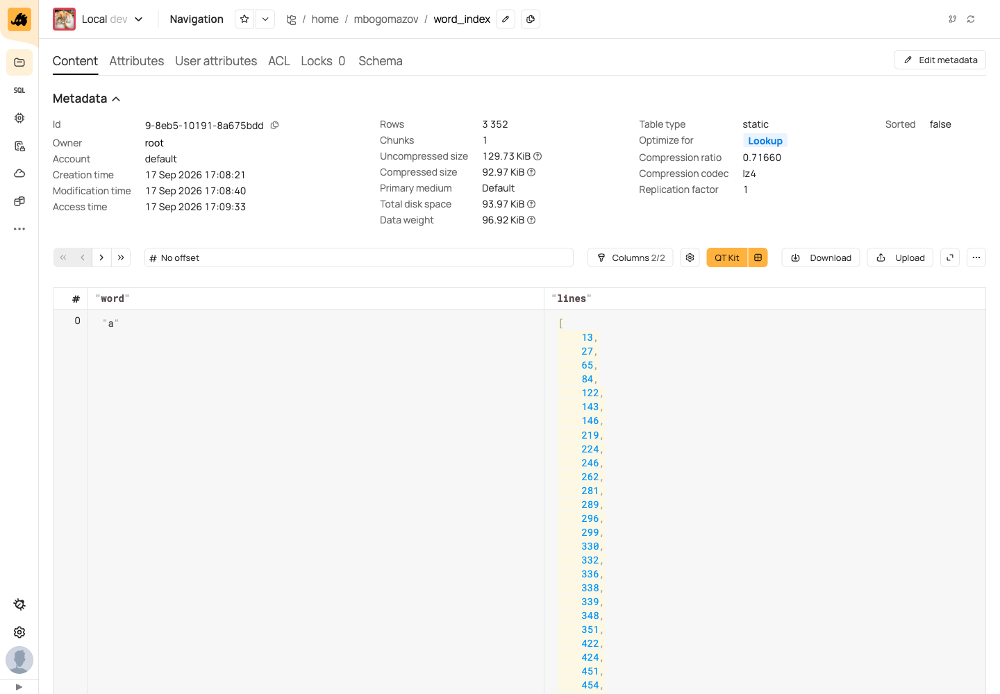
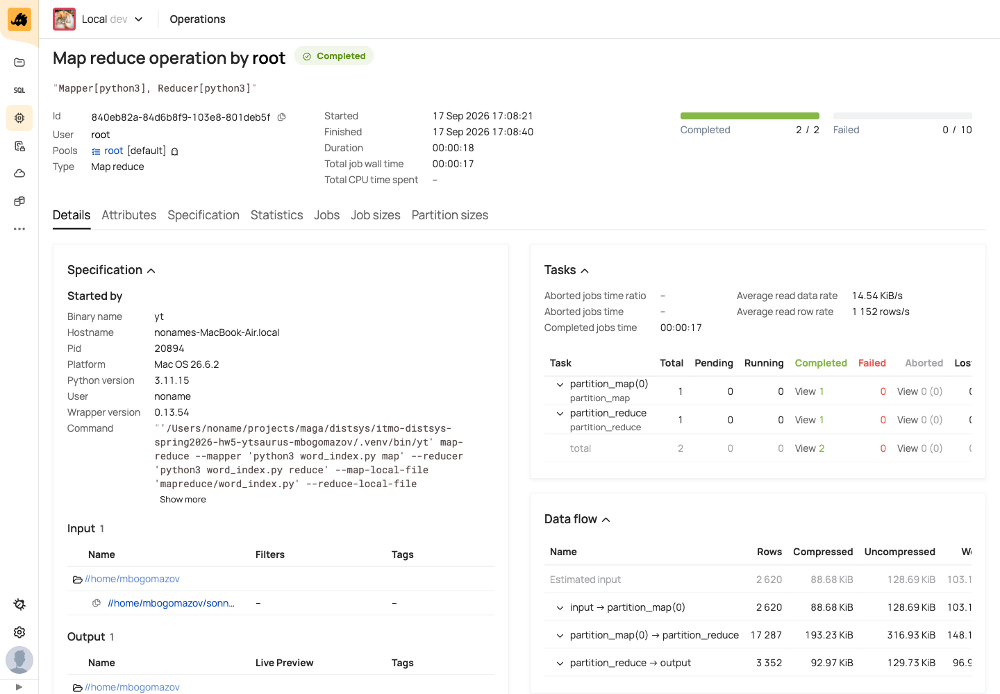
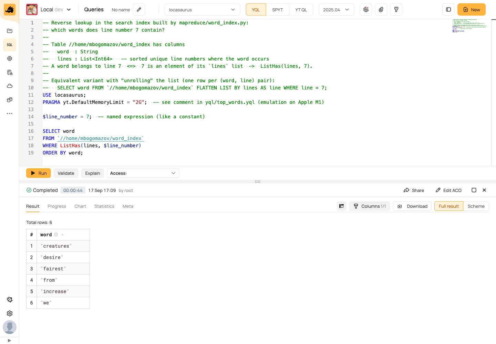

# Отчёт по ДЗ 5: YTsaurus и MapReduce

**Студент:** Богомазов М. В. · **Директория в YTsaurus:** `//home/mbogomazov`

Всё выполнено на локальном кластере YTsaurus (Docker, Apple M1, x86-эмуляция через Rosetta).
Структура репозитория:

| Папка | Содержимое |
|-------|-----------|
| [`deploy/`](./deploy) | запуск и остановка кластера, установка CLI, переменные окружения |
| [`scripts/`](./scripts) | скрипты по пунктам задания |
| [`data/`](./data) | текст (сонеты Шекспира) и скрипт его подготовки |
| [`mapreduce/`](./mapreduce) | MapReduce-задачи: официальная `word-count.py` и своя `word_index.py` |
| [`yql/`](./yql) | YQL-запросы |
| [`artifacts/`](./artifacts) | полный консольный вывод всех запусков |
| [`screenshots/`](./screenshots) | скриншоты веб-интерфейса |

Как воспроизвести всё с нуля:

```bash
./deploy/install_cli.sh     # venv + pip install ytsaurus-client (CLI `yt`)
./deploy/start.sh           # поднять кластер: UI http://localhost:18001, прокси localhost:18000
bash scripts/run_all.sh     # пункты 2-5, вывод сохраняется в artifacts/
./deploy/stop.sh            # остановка без потери данных (данные в Docker volume), снова: ./deploy/start.sh
# подробнее: deploy/STOP.md
```

---

## 1. Развёртывание YTsaurus (1 балл)

**Что сделано.** Кластер развёрнут по [официальной инструкции try-yt](https://ytsaurus.tech/docs/ru/overview/try-yt), вариант Docker.
Официальный скрипт `run_local_cluster.sh` (копия: [deploy/run_local_cluster.sh](./deploy/run_local_cluster.sh)) запускает два контейнера:
`yt.backend` (мастер, нода, планировщик, controller agent, HTTP-прокси, Query Tracker, YQL-агент) и `yt.frontend` (веб-интерфейс).

На M1 пришлось внести небольшие изменения. Все они описаны в комментарии в [deploy/start.sh](./deploy/start.sh):

* порты 18000/18001/18002 вместо 8000/8001/8002, потому что порт 8000 на ноутбуке уже занят;
* образы есть только для amd64, поэтому `--platform linux/amd64` (Docker Desktop запускает их через Rosetta);
* официальный скрипт ждёт готовности кластера 60 секунд, а под эмуляцией старт занимает около 4 минут.
  Первый запуск упал по таймауту, лог: [artifacts/00_deploy_official_script_60s_timeout.txt](./artifacts/00_deploy_official_script_60s_timeout.txt).
  В `start.sh` ожидание увеличено до 15 минут;
* `--queue-agent-count 0`: queue agent (очереди) для задания не нужен, а при загруженной машине его инициализация падала с ошибкой `No healthy tablet cells in bundle "default"`.

**Воспроизводимость проверена.** Контейнеры были удалены, кластер поднят заново через `./deploy/start.sh` (1,5 минуты, лог: [artifacts/00_deploy_start_sh.txt](./artifacts/00_deploy_start_sh.txt)), после чего `bash scripts/run_all.sh` за 2 минуты заново создал все таблицы. Все файлы в `artifacts/` и скриншоты взяты из этого чистого прогона.

CLI установлен как в инструкции (`pip install ytsaurus-client`), только в virtualenv: [deploy/install_cli.sh](./deploy/install_cli.sh). Переменные окружения лежат в [deploy/env.sh](./deploy/env.sh).

**Команды:**

```bash
./deploy/start.sh
source deploy/env.sh
yt list //home
yt list //home/mbogomazov
```

**Вывод** ([artifacts/00_deploy.txt](./artifacts/00_deploy.txt)):

```
NAMES         IMAGE                           STATUS          PORTS
yt.frontend   ghcr.io/ytsaurus/ui:stable      Up 2 minutes   0.0.0.0:18001->80/tcp
yt.backend    ghcr.io/ytsaurus/local:stable   Up 4 minutes   0.0.0.0:18002->18002/tcp, 0.0.0.0:18000->80/tcp
...
Local YT started, id: locasaurus

$ yt list //home
mbogomazov
$ yt list //home/mbogomazov
books
sonnets
word_count
word_index
```

**Скриншот:** директория `//home/mbogomazov` в веб-интерфейсе (Navigation):



---

## 2. Динамическая таблица с составным ключом (2 балла)

**Что сделано.** Три скрипта на YTsaurus CLI:

| Скрипт | Что делает | Вывод |
|--------|-----------|-------|
| [scripts/01_create_table.sh](./scripts/01_create_table.sh) | создаёт директорию `//home/mbogomazov` и **динамическую** таблицу `//home/mbogomazov/books`, монтирует её | [artifacts/01_create_table.txt](./artifacts/01_create_table.txt) |
| [scripts/02_insert_row.sh](./scripts/02_insert_row.sh) | добавляет строки (`yt insert-rows`) | [artifacts/02_insert_row.txt](./artifacts/02_insert_row.txt) |
| [scripts/03_select_by_key.sh](./scripts/03_select_by_key.sh) | читает строку по полному ключу (`yt lookup-rows` и `yt select-rows ... where`) | [artifacts/03_select_by_key.txt](./artifacts/03_select_by_key.txt) |

Схема таблицы: **составной ключ `(author, title)`**. Обе ключевые колонки помечены `sort_order = ascending`, а их порядок в схеме задаёт порядок сортировки.

```
author : utf8   (ключ, 1-я колонка)
title  : utf8   (ключ, 2-я колонка)
year   : uint32
pages  : uint32
```

**Команды и вывод:**

```bash
$ bash scripts/01_create_table.sh
+ yt create map_node //home/mbogomazov --ignore-existing
+ yt create table //home/mbogomazov/books --attributes '{
    dynamic = %true;
    schema = [
        {name = author; type = utf8;   sort_order = ascending};
        {name = title;  type = utf8;   sort_order = ascending};
        {name = year;   type = uint32};
        {name = pages;  type = uint32}
    ]
}'
1-2401-10191-80c9f24e
+ yt mount-table //home/mbogomazov/books --sync
+ yt get //home/mbogomazov/books/@tablet_state
"mounted"

$ bash scripts/02_insert_row.sh
+ yt insert-rows //home/mbogomazov/books --format json
+ yt select-rows '* from [//home/mbogomazov/books]' --format json
{"author":"Lewis Carroll","title":"Alice in Wonderland","year":1865,"pages":96}
{"author":"William Shakespeare","title":"Hamlet","year":1603,"pages":200}
{"author":"William Shakespeare","title":"Sonnets","year":1609,"pages":154}

$ bash scripts/03_select_by_key.sh
+ echo '{"author": "William Shakespeare", "title": "Sonnets"}'
+ yt lookup-rows //home/mbogomazov/books --format json
{"author":"William Shakespeare","title":"Sonnets","year":1609,"pages":154}
+ yt select-rows '* from [//home/mbogomazov/books] where author = "William Shakespeare" and title = "Sonnets"' --format json
{"author":"William Shakespeare","title":"Sonnets","year":1609,"pages":154}
```

У двух строк одинаковый `author` («William Shakespeare»), и различаются они только по `title`. Поэтому ключ из одной колонки здесь бы не сработал.

**Скриншот:** таблица в UI. Видны `Table type: dynamic`, `Tablet state: Mounted`, `Keys 2/2` и значки сортировки у `author` и `title`:


**Скриншот терминала:** запуск [scripts/02_insert_row.sh](./scripts/02_insert_row.sh) и [scripts/03_select_by_key.sh](./scripts/03_select_by_key.sh) — вставка строк (`yt insert-rows`), чтение всей таблицы, поиск по составному ключу (`yt lookup-rows`) и то же через `yt select-rows` с условием на обе колонки ключа:



---

## 3. Word Count (2 балла)

**Документ:** Уильям Шекспир, «Сонеты» (*Shakespeare's Sonnets*, Project Gutenberg [#1041](https://www.gutenberg.org/ebooks/1041), общественное достояние).
Это стихи: одна строка файла соответствует одной строке стиха. После подготовки в файле **2620 строк**.

* текст: [data/sonnets.txt](./data/sonnets.txt);
* подготовка: [data/prepare_text.py](./data/prepare_text.py). Скрипт скачивает книгу, убирает служебный заголовок и лицензию Gutenberg, заменяет типографские апострофы `’` на `'`, схлопывает подряд идущие пустые строки и пишет `data/sonnets.tsv` в формате `lineno=N<TAB>text=...`. Это тот же результат, что даёт `awk` из туториала.

Начало документа (номера строк такие же, как в таблице):

```
1  THE SONNETS
2
3  by William Shakespeare
4
5  I
6
7  From fairest creatures we desire increase,
8  That thereby beauty's rose might never die,
```

**Что сделано.** Скрипт [scripts/04_word_count.sh](./scripts/04_word_count.sh) повторяет шаги туториала: создаёт таблицы, загружает текст через `yt write-table` и запускает **официальную** MapReduce-задачу [mapreduce/word-count.py](./mapreduce/word-count.py) без изменений.

```bash
yt create table //home/mbogomazov/sonnets    --attributes '{schema = [{name = lineno; type = string}; {name = text; type = string}]}'
yt create table //home/mbogomazov/word_count --attributes '{schema = [{name = count; type = string}; {name = word; type = string}]}'
yt write-table //home/mbogomazov/sonnets --format dsv < data/sonnets.tsv
yt map-reduce --mapper "python3 word-count.py map" --reducer "python3 word-count.py reduce" \
    --map-local-file mapreduce/word-count.py --reduce-local-file mapreduce/word-count.py \
    --src //home/mbogomazov/sonnets --dst //home/mbogomazov/word_count --reduce-by word --format dsv
```

Результат: операция `completed`, в `word_count` **3208** различных слов. Полный вывод: [artifacts/04_word_count.txt](./artifacts/04_word_count.txt).

**YQL-запрос** [yql/top_words.yql](./yql/top_words.yql): топ-30 слов. Колонка `count` строковая, поэтому перед сортировкой её нужно привести к числу через `CAST`. Запуск: `bash scripts/run_yql.sh yql/top_words.yql`, вывод в [artifacts/05_top_words.txt](./artifacts/05_top_words.txt).

```sql
USE locasaurus;
PRAGMA yt.DefaultMemoryLimit = "2G";
SELECT word, CAST(count AS Uint64) AS cnt
FROM `//home/mbogomazov/word_count`
ORDER BY cnt DESC, word
LIMIT 30;
```

Про `PRAGMA`: под x86-эмуляцией джобы YQL превышали лимит памяти по умолчанию (около 520 МБ) и падали с `Memory limit exceeded`. Поэтому лимит поднят до 2 ГБ.

Результат (первые 16 из 30):

| word | cnt |  | word | cnt |
|------|-----|--|------|-----|
| and | 490 | | thou | 235 |
| the | 438 | | d | 234 |
| to | 415 | | s | 203 |
| my | 372 | | love | 195 |
| of | 370 | | with | 181 |
| i | 352 | | for | 172 |
| in | 323 | | is | 170 |
| that | 323 | | not | 167 |
| thy | 267 | | ... | |

Откуда «слова» `d` и `s`: официальный пример делит текст регуляркой `\w+`, и апостроф её разрывает: `lov'd` превращается в `lov` + `d`, `beauty's` в `beauty` + `s`. В своей задаче (п. 4) это исправлено.
Для проверки те же числа посчитаны локально на Python: [artifacts/05_top_words_local_check.txt](./artifacts/05_top_words_local_check.txt). Совпадают и 3208 различных слов, и `and 490`, `the 438`, ...

**Скриншоты:** YQL-запрос с самыми частыми словами (Queries):



Входная таблица с текстом документа, строка 7 = «From fairest creatures we desire increase,»:



Операция MapReduce Word Count в разделе Operations: [screenshots/03b_word_count_operation.png](./screenshots/03b_word_count_operation.png)

---

## 4. Word Index, часть 1: своя MapReduce-задача (3 балла)

**Код:** [mapreduce/word_index.py](./mapreduce/word_index.py), запуск: [scripts/06_word_index.sh](./scripts/06_word_index.sh).

Задача сделана по образцу `word-count.py`: тот же streaming-режим, один скрипт с аргументом `map` или `reduce`. Отличия:

* **map:** из строки `(lineno, text)` получаем набор **различных** слов строки (`set`) и для каждого выдаём `(word, lineno)`.
  Нормализация: нижний регистр, пунктуация отбрасывается, слово — латинские буквы с апострофами внутри (`feed'st`, `beauty's`);
* **shuffle/sort:** YTsaurus сам сортирует и группирует вывод map по `word` (`--reduce-by word`);
* **reduce:** для каждого слова собирает **отсортированный список уникальных** номеров строк и выдаёт `{"word": ..., "lines": [...]}`.
  Номера строк 1-based, они назначены заранее при подготовке данных (map-джобы обрабатывают куски таблицы параллельно, поэтому сами номер строки узнать не могут);
* формат вывода reduce: `json`, потому что в dsv нельзя записать список. Колонка `lines` в результирующей таблице имеет настоящий тип **`List<Int64>`**, так что в YQL можно сразу использовать `ListHas`.

```bash
yt create table //home/mbogomazov/word_index --force --attributes '{schema = [
    {name = word;  type = string};
    {name = lines; type_v3 = {type_name = list; item = int64}}
]}'
yt map-reduce \
    --mapper  "python3 word_index.py map" --reducer "python3 word_index.py reduce" \
    --map-local-file mapreduce/word_index.py --reduce-local-file mapreduce/word_index.py \
    --src //home/mbogomazov/sonnets --dst //home/mbogomazov/word_index \
    --reduce-by word \
    --map-input-format dsv --map-output-format dsv --reduce-input-format dsv --reduce-output-format json
```

**Результаты запуска** ([artifacts/06_word_index.txt](./artifacts/06_word_index.txt)):

```
operation 8b2b5667-42ad9dab-103e8-24206f43: running=1 completed=1 pending=0 failed=0 aborted=0 ... total=2
operation 8b2b5667-42ad9dab-103e8-24206f43 completed
+ yt get //home/mbogomazov/word_index/@row_count
3352
+ yt read-table '//home/mbogomazov/word_index[:#10]' --format json
{"word":"a","lines":[13,27,65,84,122,143,146,219,224,246,262,...]}
{"word":"abhor","lines":[2549,2550]}
{"word":"abide","lines":[453,756]}
{"word":"able","lines":[1441]}
{"word":"above","lines":[1457,1542,1866,2067]}
{"word":"absence","lines":[661,965,981,1639,1845]}
...
```

Поток данных по статистике операции (скриншот ниже): 2620 строк на входе map, 17287 пар `(word, lineno)` между map и reduce, 3352 строки на выходе reduce.

Выборка из индекса [yql/word_index_preview.yql](./yql/word_index_preview.yql) → [artifacts/06_word_index_preview.txt](./artifacts/06_word_index_preview.txt):

```
{"word":"creatures","lines_count":2,"lines":[7,2421]}
{"word":"desire","lines_count":11,"lines":[7,167,757,865,866,960,1029,2088,2392,2495,2613]}
{"word":"fairest","lines_count":5,"lines":[7,1794,2219,2227,2611]}
{"word":"feed'st","lines_count":1,"lines":[12]}
{"word":"increase","lines_count":4,"lines":[7,181,249,1644]}
```

Код проверен и без кластера: локальный прогон `map | sort | reduce` ([artifacts/word_index_local.jsonl](./artifacts/word_index_local.jsonl)) тоже даёт 3352 слова с теми же списками.

**Скриншоты:** таблица `word_index` с данными (колонка `lines` — список):



Выборка из индекса через YQL: [screenshots/05b_word_index_preview_yql.png](./screenshots/05b_word_index_preview_yql.png)

Операция MapReduce в разделе Operations: map и reduce завершены, в Data flow видно 2620 → 17287 → 3352:



---

## 5. Word Index, часть 2: YQL-запрос «слова строки 7» (2 балла)

**Запрос:** [yql/words_in_line.yql](./yql/words_in_line.yql)

```sql
USE locasaurus;
PRAGMA yt.DefaultMemoryLimit = "2G";

$line_number = 7;

SELECT word
FROM `//home/mbogomazov/word_index`
WHERE ListHas(lines, $line_number)
ORDER BY word;
```

Идея: слово входит в строку 7 тогда и только тогда, когда число 7 есть в его списке `lines`. `ListHas(list, x)` проверяет, содержит ли список элемент.
Тот же результат даёт вариант с «разворачиванием» списка:
`SELECT word FROM ... FLATTEN LIST BY lines AS line WHERE line = 7`. Он тоже проверен и выдаёт те же 6 слов.

**Команда:** `bash scripts/run_yql.sh yql/words_in_line.yql`

**Результат** ([artifacts/07_words_in_line.txt](./artifacts/07_words_in_line.txt)):

```
{"word":"creatures"}
{"word":"desire"}
{"word":"fairest"}
{"word":"from"}
{"word":"increase"}
{"word":"we"}
```

**Проверка по исходному тексту** ([artifacts/07_line7_local_check.txt](./artifacts/07_line7_local_check.txt)):

```
$ sed -n 7p data/sonnets.txt
From fairest creatures we desire increase,
$ python3 -c "...та же нормализация, что в word_index.py..."
['creatures', 'desire', 'fairest', 'from', 'increase', 'we']
```

**Скриншот:**


